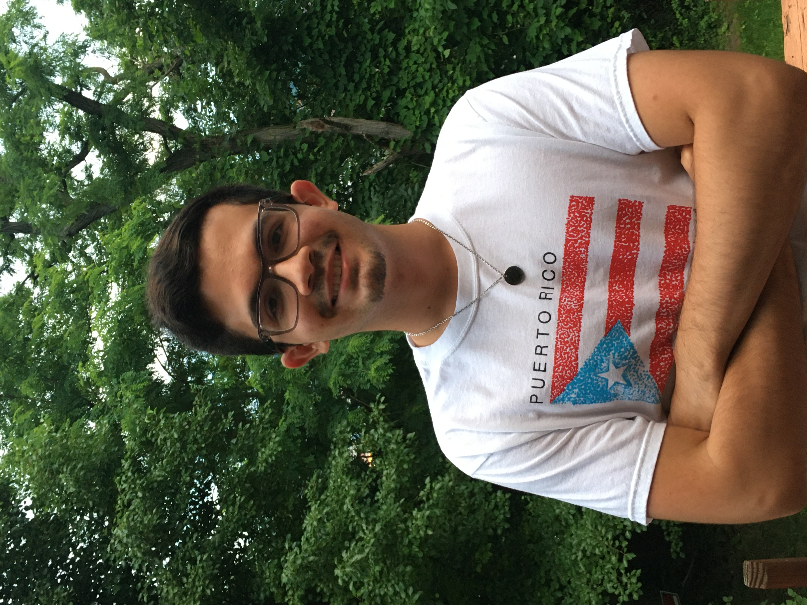

## Short Biography
Jacob M. Delgado-López is an undergraduate senior student at the University of Puerto Rico Mayagüez, where he is pursuing a Bachelor in Computer Science and Engineering. Throughout his undergraduate studies, he has always had a passion for teaching and mentoring others, as well as an interest in the impacts of new technologies on societal issues. These have developed his desire to pursue a PhD after graduation as well as further post-doctoral studies. 

## Full Biography
Jacob M. Delgado-López is an undergraduate senior student at the University of Puerto Rico Mayagüez, where he is pursuing a Bachelor in Computer Science and Engineering. Throughout his undergraduate studies, he has always had a passion for teaching and mentoring others, as well as an interest in the impacts of new technologies on societal issues. Driven by his passion for social impact and teaching, he actively engages as a tutor, teaching assistant, and speaker with the goal of engaging with the student community and fostering a culture of learning and collaboration. In conjunction with his studies, he has participated in several REU programs, which have polished his ability to conduct research effectively and collaborate efficiently within a diverse research environment. All of these combined have developed his desire to pursue a PhD after graduation as well as further post-doctoral studies.

## Photo 

    

